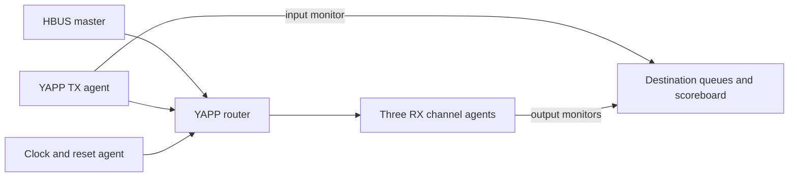

# YAPP Packet Router Verification with UVM

A SystemVerilog/UVM verification project for a packet router with one input, three output channels, and an HBUS configuration interface. It combines constrained-random packets, reusable verification agents, virtual sequences, and a queue-based end-to-end scoreboard.

**Portfolio:** [Hadleeraj](https://github.com/Hadleeraj) · **Original project:** [EDA Playground](https://www.edaplayground.com/x/ZzcD)

## Verified smoke result

The added `portfolio_smoke_test` completed on **Cadence Xcelium 25.03-s001 / UVM 1.2**, seed **1**, on 9 September 2026:

| Check | Observed result |
|---|---:|
| Input packets | 30 |
| Channel 0 / 1 / 2 matches | 10 / 10 / 10 |
| Miscompares / unexpected packets | 0 / 0 |
| Pending expected packets | 0 |
| UVM errors / fatals | 0 / 0 |
| UVM warnings | 1 legacy configuration-API deprecation warning |

This is a reproducible smoke baseline, not a completed protocol sign-off or coverage-closure claim. See [verification notes](VERIFICATION.md) and the [run excerpt](results/smoke_excerpt.log).

## Architecture



`testbench.sv` is retained as the original playground entry. Use **portfolio_testbench.sv** for the validated smoke regression.


A UVM YAPP transmitter drives the router input; three channel agents provide receiver backpressure and observe routed packets. An HBUS master configures the router. The clock/reset agent initializes the interfaces. The input monitor clones packets into destination-specific scoreboard queues, and output monitors compare address, length, payload, and parity against those queues.

## Skills demonstrated

- SystemVerilog classes, constrained randomization, dynamic payload arrays, and parity generation.
- UVM factory registration/overrides, configuration database, phases, objections, sequencers, drivers, and monitors.
- Analysis-port connectivity and per-destination queue scoreboarding.
- Coordination of HBUS configuration and packet traffic; a virtual sequencer and sequence library are included.
- Simulation debugging of receive FIFO flow control, timeout detection, and explicit completion checks.

## Packet and test scope

The header contains a six-bit payload length and two-bit destination. Legal stimulus targets destinations 0, 1, and 2; payload bytes are followed by XOR parity. The transaction model supports lengths 1–63 and good/bad parity generation. The short-packet subtype restricts lengths to 1–14.

The smoke test explicitly starts a 10 ns clock/reset sequence and all three receive-response sequences, writes the maximum-packet-size and enable registers through HBUS, then sends **30 good-parity packets of length 1–14**, cycling through the three destinations. It uses randomized receive delays, waits for all 30 matches, checks ten matches per channel and empty queues, and enforces a 100 us watchdog.

The original library also includes repeated-address, incremental-payload, short-packet, and virtual-sequence examples. Their presence does not mean that all are passing regressions.

## Run

Use a licensed simulator with SystemVerilog, UVM 1.2, constraints, and covergroup support. UVM and simulator binaries are external dependencies.


```bash
git clone https://github.com/Hadleeraj/YAPP-Router-UVM-Verification.git
cd YAPP-Router-UVM-Verification
export UVM_HOME=/path/to/your/uvm/library
bash run.sh
```

`run.sh` uses the Xcelium invocation observed on EDA Playground, with `files.f` selecting the repository smoke top. Pass additional supported simulator arguments through the script. A baseline run uses the simulator default seed 1; record any seed overrides with your results.

**Compile only the roots listed in files.f.** Supporting sources are included by the package/top files. Do not compile both `testbench.sv` and `portfolio_testbench.sv`: both define `tb_top`.

For browser reproduction, open the original playground, apply the documented receive-driver fix, and use the smoke test/top from this repository. The published original playground is retained as provenance; repository additions are not automatically synchronized back to it.

## Repository guide

| Files | Role |
|---|---|
| `portfolio_testbench.sv`, `portfolio_smoke_test.sv` | Smoke entry, explicit initialization, traffic and completion checks |
| `testbench.sv`, `router_test_lib.sv` | Original entry and test examples |
| `yapp_*.sv` | Input transaction model, UVC, interface, stimulus and router RTL |
| `channel_*.sv` | Three reusable receive-channel UVC instances |
| `hbus_*.sv` | Host-bus agents, transactions, sequences and register adapter |
| `clock_and_reset_*.sv`, `clkgen.sv` | Clock/reset UVC and RTL clock generation |
| `router_tb.sv`, `hw_top1.sv` | UVM environment connectivity and hardware wiring |
| `router_mc*.sv`, `router_scoreboard.sv` | Virtual sequence coordination and packet checking |
| `design.sv`, `files.f`, `run.sh`, `check_log.py` | Compilation roots and simulation/log checks |

## Changes made for reproducibility

The 53 original source tabs are included. In `channel_rx_driver.sv`, the receive interface now **keeps suspend asserted after reset until the response sequence releases it**. Previously the FIFO could drain before the receiver was ready, leading to lost packet alignment and scoreboard mismatches. The source copyright header is retained.

The portfolio smoke test and top are additions. The original default `short_packet_test` does not start clock/reset and timed out during baseline review. A `simple_test` trial generated three input packets but left expected packets in the scoreboard. Those outcomes are documented instead of being presented as passing tests.

## Limits and next steps

Coverage groups exist in the channel and HBUS monitors, but no coverage-closure percentage is claimed for this smoke run. The smoke exercises good-parity short packets and HBUS writes; it does not establish register readback, malformed-packet handling, maximum-length traffic, reset during traffic, or all backpressure corners. The DUT error port is currently unconnected in `hw_top1.sv`.

The original scoreboard can print a success message even after its check phase reports pending packets. Always inspect the full UVM summary; the added smoke-count check and log checker provide explicit pass criteria. The `UVM` comparison policy currently delegates to the same field comparison as `EQUAL`.

Future work: directed illegal-address/parity/length tests with an expected-drop model, verified HBUS readback and register modeling, coverage-driven multi-seed regressions, and reset/backpressure stress tests.

## Attribution

This portfolio is based on my EDA Playground YAPP verification exercise using Cadence training/reference material. The router and many UVC support files retain their original developer and copyright notices. They are not represented as independently authored RTL. See [ATTRIBUTION.md](ATTRIBUTION.md); no new blanket license is applied to third-party material.
